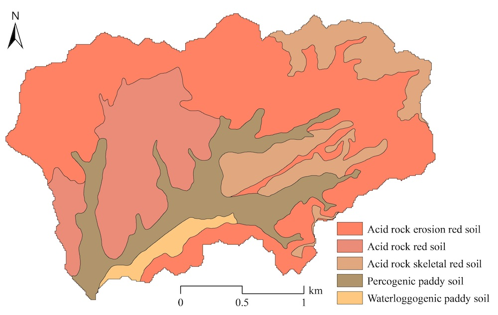

示例流域数据准备 {#getstart_data_preparation}
==========================================================

[TOC]

简单来说，流域建模就是根据地理信息数据（如数字高程模型[DEM]，土地利用图和土壤类型图）、气象数据和管理数据等，利用经验公式或物理公式模拟流域的行为simulate the behavior of watershed，如径流、土壤侵蚀和养分循环。因此，数据收集和准备是流域建模的第一关键步骤。
作为示例，选择了中国福建长汀县游屋圳小流域的数据进行长期（即以每日为时间步长）流域建模和应用。is selected for long-term (i.e., daily time-step) watershed modeling and application

# 文件格式的基本约定
基本上，基于SEIMS流域模型的输入数据包括两类：空间数据和纯文本数据。
## 空间数据
空间数据包括栅格数据和矢量数据。理论上，SEIMS支持所有GDAL支持的栅格（https://www.gdal.org/formats_list.html）和矢量（https://www.gdal.org/ogr_formats.html）数据格式。然而，强烈推荐使用最常见的GeoTIFF格式作为栅格数据以及ESRI Shapefile格式作为矢量数据。
+ 请确保所有的空间数据有相同的投影坐标系，而非地理坐标系。
+ 不同栅格数据的空间范围不必完全一致。但是，同一位置的网格单元最好重合，否则，栅格数据将基于DEM数据进行插值，这可能造成不希望的失真。
## 纯文本 {#dataprep_basic_plaintest}
除了空间数据，几乎所有其他数据都可以以纯文本形式提供。纯文本的基本约定如下：
+ 以数字符号（`#`）开头的行将被SEIMS视为注释行并忽略。然而，有一个例外，当纯文本文件的第一行用于记录时间系统和时区时，如 `#LOCALTIME 8` 表示当前文件中记录的时间为东八区时间，`#UTCTIME` 表示协调世界时（即格林尼治时间，GMT）。
+ 如果需要，第一条有效行可用作标题。
+ 每行数据中的值以逗号（`,`）分隔。
+ 在每个值内，主要分隔符为短划线（`-`），次要分隔符为冒号（`:`）。

例如，如下所示的纯文本
```
# This line is a comment.
SUBSCENARIO,NAME,LANDUSE,PARAMETERS
1, Closing measures,7-16,Interc_max:Maximum Interception Capacity:AC:1-Conductivity:Soil hydraulic conductivity:RC:3.5
``` 
可以解析为类似字典的Python数据结构：
```
demo_dict = {
    'SUBSCENARIO': 1,
    'NAME':'Closing measures'
    'LANDUSE': [7, 16],
    'PARAMETERS': [
        ['Interc_max', 'Maximum Interception Capacity', 'AC', 1],
        ['Conductivity', 'Soil hydraulic conductivity', 'RC', 3.5]        
    ]
}
```
# 空间数据
名为游屋圳小流域的示例数据（约5.39km<sup>2</sup>）位于中国福建省长汀县河田镇（[Fig. Youwuzhen Map](@ref fig_ywz_loc)）。该区域属于中国东南部典型的红壤丘陵地区，遭受严重的土壤侵蚀。流域以低山、丘陵地貌为主，地质自东北向西南方向倾斜（最大坡度达到52.9°，平均坡度为16.8°），河流沿岸地势较平坦，海拔295.0~556.5米。土地利用类型主要为林地、水田和果园，分别占59.8%、20.6%、12.8%。（[Fig. Youwuzhen Landuse](@ref fig_ywz_lucc)）。流域土壤以红壤为主，占78.4%，水田土占21.6%，分别可以在美国土壤分类系统中归类为*Ultisols*和*Inceptisols*（[Fig. Youwuzhen Soil Type](@ref fig_ywz_soiltype)）。

为了提高本手册示例中的计算效率，DEM（`ywzdem30m.tif`）、土地利用图（`ywzlanduse30m.tif`）和土壤类型图（`ywzsoil30m.tif`）均统一为30米分辨率。

\anchor fig_ywz_loc  

**图. 游屋圳小流域位置**

\anchor fig_ywz_lucc  

**图. 游屋圳小流域土地利用图**

\anchor fig_ywz_soiltype  

**图. 游屋圳小流域土壤类型图**

游屋圳小流域的出口位置（即矢量点）已作为ESRI Shapefile准备。如果出口数据无法预先确定，则具有最大流量累积位置（即网格单元的中心）将被标记为当前研究区的出口。

在SEIMS的当前版本中，覆盖整个流域的气象站和降水站的泰森多边形也应作为矢量多边形数据提供，例如`thiessen_meteo.shp` 和 `thiessen_pcp.shp`。每个多边形的属性应包括唯一的ID（`ID`），与后续引入的站点ID一致、站点名称（`Name`）、投影坐标系下的X和Y坐标（`LocalX` 和 `LocalY`）、WGS84坐标系下的经度和纬度（`Lat` 和 `Lon`）以及海拔（`Elevation`）。

> **TODO**: 应该去除对气象站和降水站的泰森多边形的要求，因为以纯文本的形式呈现这些站点的空间信息（see [此处](@ref dataprep_spatial_pcp_station)）可以提供类似的信息。

所有这些空间数据位于`SEIMS\data\youwuzhen\data_prepare\spatial`。

# 降水数据
游屋圳小流域的多年平均降水量为1697.0毫米，降雨年内分配为双峰型，雨量集中且强度大，3-8月的降雨总量可占全年的75.4%。
## 降水站的空间信息 {#dataprep_spatial_pcp_station}
降水站的空间信息字段如 [表. 降水站](@ref tab_pcpstation).

\anchor tab_pcpstation **表. 降水站字段**

|      字段名称     |      数据类型     |      描述     |
|---|---|---|
|     StationID    |     整型    |     站点的唯一 ID    |
|     Name    |     字符串型    |     站点名称    |
|     LocalX    |     浮点型    |     投影坐标系下的X坐标（单位：米）     |
|     LocalY    |     浮点型    |     投影坐标系下的X坐标（单位：米）    |
|     Lat    |     浮点型    |     WGS84坐标系下的纬度（单位：度）    |
|     Lon    |     浮点型    |     WGS84坐标系下的经度（单位：度）    |
|     Elevation    |     浮点型    |     海拔高度（单位：米）    |

例如，文件 `SEIMS\data\youwuzhen\data_prepare\climate\Sites_P.csv`的内容如下：
```
StationID,Name,LocalX,LocalY,Lon,Lat,Elevation
81502750,HeTianZhan,39444759.232,2840563.152,116.4,25.683333,298
```

## 降水数据记录
首行为时间系统和时区的声明 （参见[此处](@ref dataprep_basic_plaintest)）如果未提供，将默认为`#UTCTIME`。
降水数据的字段和格式如下。

\anchor tab_pcp_dataitem **表. 降水数据项的字段和格式**

|      字段名称     |      数据类型     |      描述     |
|---|---|---|
|     DATETIME    |     日期时间字符串    |     日期时间，格式为 `YYYY-MM-DD HH:MM:SS`    |
|     StationIDs    |     浮点型    |     每个站点ID的降水量值。多个站点可以为 `StationID1`,`StationID2`, … `StationIDN`    |

因此，降水数据记录的内容类似于（`SEIMS\data\youwuzhen\data_prepare\climate\pcp_daily.csv`）：
```
#UTCTIME
DATETIME,81502750
2012-01-01 00:00:00,0
2012-01-02 00:00:00,0
2012-01-03 00:00:00,9.00
2012-01-04 00:00:00,16.50
2012-01-05 00:00:00,16.00
2012-01-06 00:00:00,1.50
```

# 气象数据
游屋圳小流域地处中亚热带季风性湿润气候，多年平均气温为18.3 °C。
气象站的数据格式与降水站相同（参见[此处](@ref dataprep_spatial_pcp_station)），例如 `SEIMS\data\youwuzhen\data_prepare\climate\Sites_M.csv`。

与降水数据相同，气象数据文本的首行为时间系统和时区的声明（参见[此处](@ref dataprep_basic_plaintest)）如果未提供，将默认为 `#UTCTIME`。气象数据的字段和格式如下。
**注意这些字段的顺序不固定。**

\anchor tab_meteo_dataitem **表. 气象数据项的字段和格式**

|      字段名称     |      数据类型     |      描述     |
|---|---|---|
|     StationID    |     整型    |     站点ID    |
|     DATETIME    |     日期时间字符串    |     日期时间，格式为 YYYY-MM-DD HH:MM:SS    |
|     TMAX    |     浮点型    |     最高气温（单位：摄氏度）    |
|     TMIN    |     浮点型    |     最低气温（单位：摄氏度）    |
|     TMEAN    |     浮点型    |     （可选） 平均气温（单位：摄氏度）    |
|     RM    |     浮点型    |     相对湿度（单位：%）    |
|     WS    |     浮点型    |     风速（单位：米/秒）    |
|     SR or SSD    |     浮点型    |     太阳辐射（单位兆焦/平方米/天）或日照时长（单位：小时）    |
|     PET    |     浮点型    |     潜在蒸散量（单位：毫米）    |

因此，气象数据记录的内容类似于（`SEIMS\data\youwuzhen\data_prepare\climate\meteo_daily.csv`）：
```
#LOCALTIME 8
StationID,DATETIME,TMEAN,TMAX,TMIN,RM,WS,SSD
58911,2012-01-01 20:00:00,10.0 ,13.6 ,7.8 ,76 ,1.2 ,1.2
58911,2012-01-02 20:00:00,10.6 ,15.7 ,7.0 ,73 ,0.7 ,1.5
58911,2012-01-03 20:00:00,7.1 ,12.0 ,4.6 ,89 ,1.6 ,0.0
58911,2012-01-04 20:00:00,3.9 ,6.6 ,2.5 ,78 ,1.7 ,0.0
```

此外，每种数据类型的单位也应提供，例如 `SEIMS\data\youwuzhen\data_prepare\climate\Variables.csv`。

> **TODO**: 在当前的SEIMS版本中，单位应与表3中一致。为了增强SEIMS对常用单位的兼容性，将来应增加一些单位转换功能。

# 观测数据
流域内定期监测的流量、泥沙或养分数据被视为观测数据。观测数据组织为一个站点信息文件和若干个与监测站点和监测变量数量相对应的数据文件。
## 监测站点的空间信息
监测站点的空间信息如下所示。

\anchor tab_obs_site **表. 监测站点数据的字段**

|      字段名称     |     数据类型     |      描述     |
|---|---|---|
|     StationID    |     整型    |     唯一的站点ID    |
|     Name    |     字符串型    |     站点名称    |
|     Type    |     字符串型    |     监测变量，多个变量之间使用短横线作为分隔符。避免在单一变量类型中使用短横线。    |
|     Unit    |     字符串型    |     监测变量的单位，多个单位之间使用短横线作为分隔符。避免在单一单位中使用短横线。    |
|     LocalX    |     浮点型    |     投影坐标系下的X坐标（单位：米）    |
|     LocalY    |     浮点型    |     投影坐标系下的Y坐标（单位：米）    |
|     Lat    |     浮点型    |     WGS84坐标系下的纬度（单位：度）    |
|     Lon    |     浮点型    |     WGS84坐标系下的经度（单位：度）    |
|     Elevation    |     浮点型    |     海拔高度（单位：米）    |
|     isOutlet    |     整型    |     监测站点的类型：<br>     1: 流域出口<br>     2: 子流域出口<br>     3: 多个子流域的交汇点<br>     0: 其他空间位置    |

例如， `SEIMS\data\youwuzhen\data_prepare\observed\SiteInfo.csv`：
```
StationID,Name,Type,Lat,Lon,LocalX,LocalY,Unit,Elevation,isOutlet
1,hetianzhan,SED,25.680207,116.406401,440409.511725,2841541.17804,g/L,280,1
1,hetianzhan,Q,25.680207,116.406401,440409.511725,2841541.17804,m3/s,280,1
```

请注意，观测数据主要用于后处理，例如与相应的模拟值匹配。因此，`Type` 字段应与基于SEIMS的流域模型的输出相符。所有当前可用的输出可以在`SEIMS\seims\preprocess\database\AvailableOutputs.csv`找到。例如，如果监测总氮量数据，根据河道中总氮量输出项的 `FILENAME` 字段（显然，不包括后缀，例如 `.txt`），类型应为`CH_TN`：
```
MODULE_CLASS,OUTPUTID,DESCRIPTION,UNIT,TYPE,STARTTIME,ENDTIME,INTERVAL,INTERVAL_UNIT,SUBBASIN,FILENAME,USE
NutrientTransport,CH_TN,total nitrogen amount in reach,kg,NONE,1970-01-01 00:00:00,1970-01-01 00:00:00,-9999,-9999,ALL,CH_TN.txt,0
```

## 观测数据记录
与降水数据格式类似，观测数据的首行为时间系统和时区的声明（参见[此处](@ref dataprep_basic_plaintest)）。如果未提供，将默认为 `#UTCTIME`。观测数据的字段和格式如下。

\anchor tab_obs_dataitem **表. 观测数据项的字段和格式**

|      字段名称     |      数据类型     |      描述     |
|---|---|---|
|     StationID    |     整型    |     站点ID    |
|     DATETIME    |     日期时间字符串    |     日期时间，格式为 YYYY-MM-DD HH:MM:SS    |
|     Type    |     字符串型    |     监测变量    |
|     VALUE    |     浮点型    |     当前变量在当前日期时间的监测值    |

因此，观测数据记录的内容类似于（
`SEIMS\data\youwuzhen\data_prepare\observed\observed_Q.csv`）：
```
#UTCTIME
StationID,DATETIME,Type,VALUE
1,2012-01-14 00:00:00,Q,0.1615
1,2012-01-15 00:00:00,Q,0.578
1,2012-01-16 00:00:00,Q,0.4317
```

# 查找表
查找表包括作物、肥料、耕作、土地利用、土壤和城市，均来自SWAT并预定义在 `SEIMS\seims\preprocess\database`中。特定研究区的参数可以附加到这些查找表中，也可以在`SEIMS\data\youwuzhen\data_prepare\lookup`中准备单独的文件。
以下是最常用查找表的详细信息。
## 土壤特性
土壤特性包括物理特性和化学特性。字段和描述如[表. 土壤查找表](@ref tab_soil_lookup)所示。可选参数可以省略。
注意， `SEQN` 和 `NAME` 不一定与土壤类型（`SOILCODE`）一致，以便根据不同的土壤覆盖或地形位置表示相同土壤类型的异质性。然而， `SEQN` **必须** 与土壤类型图中的值一致，即 `ywzsoil30m.tif`。多个土壤层的土壤特性使用短横线（`-`）连接，如[此处](@ref dataprep_basic_plaintest)所述。

\anchor tab_soil_lookup **表. 土壤属性查找表中的字段和描述**

|      字段名称     |      数据类型     |      单位     |      描述     |
|---|---|---|---|
|     SEQN or SOILCODE    |     整型    |     -    |     土壤类型图的唯一标识符    |
|     NAME    |     字符串型    |     -    |     土壤名称    |
|     SOILLAYERS    |     整型    |     -    |     土壤层数    |
|     SOL_Z    |     浮点数组    |     mm    |     从土壤表面到土壤层底部的深度    |
|     SOL_OM    |     浮点数组    |     %    |     有机质含量    |
|     SOL_CLAY    |     浮点数组    |     %    |     粘土含量，直径 D < 0.002 mm    |
|     SOL_SILT    |     浮点数组    |     %    |     粉砂含量，0.002 mm < D < 0.05 mm    |
|     SOL_SAND    |     浮点数组    |     %    |     沙子含量，0.05 mm < D < 2 mm    |
|     SOL_ROCK    |     浮点数组    |     %    |     石块含量，D > 2 mm    |
|     SOL_BD    |     浮点数组    |     Mg/m<sup>3</sup>    |     湿容重，取值范围 1.1 ~ 1.9    |
|     SOL_AWC    |     浮点数组    |     mm    |     可利用水容量    |
|     SOL_ZMX    |     浮点型    |     mm    |     （可选）土壤剖面的最大根系深度    |
|     ANION_EXCL    |     浮点型    |     -    |     （可选）从阴离子被排除的孔隙（空隙）比例，默认为 0.5    |
|     SOL_CRK    |     浮点型    |     -    |     （可选）土壤剖面的最大裂隙体积，以总土壤体积的比例表示。    |
|     SOL_K    |     浮点数组    |     mm/hr    |     （可选）饱和导水率    |
|     SOL_WP    |     浮点数组    |     mm    |     （可选）萎焉点    |
|     SOL_FC    |     浮点数组    |     mm    |     （可选）田间持水量     |
|     SOL_POROSITY    |     浮点数组    |     -    |     （可选）孔隙率    |
|     SOL_USLE_K    |     浮点数组    |     -    |     （可选） USLE K 因子    |
|     SOL_ALB    |     浮点型    |     -    |     （可选）湿润土壤时的反照率    |
|     ESCO    |     浮点型    |     -    |     （可选）土壤蒸发补偿因子，默认为 0.95    |
|     SOL_NO3    |     浮点数组    |     g/kg    |     （可选）硝酸盐浓度    |
|     SOL_NH4    |     浮点数组    |     g/kg    |     （可选）土壤中的铵氮浓度    |
|     SOL_ORGN    |     浮点数组    |     g/kg    |     （可选）有机氮浓度     |
|     SOL_ORGP    |     浮点数组    |     g/kg    |     （可选）有机磷浓度    |
|     SOL_SOLP    |     浮点数组    |     g/kg    |     （可选）可溶性磷浓度    |

因此，研究区的土壤特性查找表的内容类似于（`SEIMS\data\youwuzhen\data_prepare\lookup\soil_properties_lookup.csv`）：
```
SEQN,SNAM,SOILLAYERS,SOL_ZMX,SOL_Z,SOL_BD,SOL_OM,SOL_CLAY,SOL_SILT,SOL_SAND,SOL_ROCK,SOL_WP,SOL_FC,SOL_POROSITY,SOL_K,SOL_AWC,SOL_NO3,SOL_NH4,SOL_ORGN,SOL_SOLP,SOL_ORGP
201,WNT,3,600,200-400-600,1.5-1.57-1.45,2.31-0.84-0.84,15.66-17.36-20.94,13.8-17.31-22.23,52.25-44.6-35.9,18.29-20.73-20.93,0.12-0.14-0.18,0.21-0.24-0.31,0.44-0.41-0.45,26.16-11.43-7.87,0.1-0.1-0.13,0.004-0.002-0.002,0-0-0,0.164-0.079-0.077,0.005-0.002-0.001,0.047-0.018-0.012
```

## 初始土地覆盖参数
在模拟开始时应定义一些土地覆盖的参数。字段和描述如[表. LUCC Lookup](@ref tab_soil_lookup)所示。请参照预定义数据库`seims/preprocess/database/CropLookup.csv` 和 `LanduseLookup.csv`。

\anchor tab_lucc_lookup **表. 初始土地覆盖参数查找表中的字段和描述**

|      字段名称     |      数据类型     |      Unit     |      描述     |
|---|---|---|---|
|     LANDUSE_ID    |     整型    |     -    |     土地利用ID（必须覆盖土地利用图中的ID）    |
|     IGRO    |     整型    |     -    |     Land 土地覆盖状态：0-无生长；1-生长中    |
|     LANDCOVER or ICNUM    |     整型    |     -    |     ICNUM， 土地覆盖ID号（当IGRO为1时必填）     |
|     LAI_INIT    |     浮点型    |     -    |     初始叶面积指数 （当IGRO为1时必填）    |
|     BIO_INIT    |     浮点型    |     kg/ha    |     初始生物量（当IGRO为1时必填）    |
|     PHU_PLT    |     浮点型    |     degC    |     使植物达到成熟所需的热量单位数（当IGRO为1时必填）    |
|     EPCO    |     浮点型    |     -    |     植物吸收补偿因子，范围0.01 ~ 1    |
|     RSDIN    |     浮点型    |     kg/ha    |     初始残留覆盖量    |
|     CURYR_INIT    |     浮点型    |     year    |     初始树龄    |
|     CHT    |     浮点型    |     m    |     初始树冠高度    |
|     DORMI    |     浮点型    |     -    |     休眠状态代码：1-生长中，0-休眠    |
|     USLE_P    |     浮点型    |     -    |     USLE的保护性管理因子    |

因此，特定研究区域的初始土地覆盖参数查找表的内容类似于（`SEIMS\data\youwuzhen\data_prepare\lookup\landcover_initial_parameters.csv`）：
```
LANDUSE_ID,IGRO,LANDCOVER,LAI_INIT,BIO_INIT,PHU_PLT,EPCO,RSDIN,CURYR_INIT,CHT,DORMI,USLE_P
33,0,33,0,0,0,1,100,0,0,0,0.084
4,1,4,2,200,0,1,200,2,2,0,0.8
8,1,8,3,1000,0,1,300,5,5,0,0.8
6,1,6,2,600,0,1,200,3,2,0,0.8
18,0,18,0,0,0,0,0,0,0,0,1
104,0,-9999,0,0,0,0,0,0,0,0,1
106,0,-9999,0,0,0,0,0,0,0,0,1
```

# 管理措施数据
SEIMS支持或将支持三种不同类型的最佳管理措施（BMPs）。
+ 河段BMP：与特定河段相关的BMP，会改变该河段的特征，如点源、河流分流、水库、河岸湿地、河岸缓冲区等。
+ 面积结构性BMP：与流域中某个特定结构相关的BMP，会改变特定位置的特性，如草地水道、过滤带、池塘、独立湿地、梯田、地表分流、排水管管理和城市管理等。
+ 面积非结构性BMP：不与流域中某个特定结构相关的BMP，会改变特定位置的特征，如植物管理。

本节首先介绍BMP情景的组织，然后详细说明不同BMP的参数设置。在本用户手册的当前版本中，以植被管理和一般的面积结构性BMP为示例。更多的BMP将在未来版本中更新。

##	BMP情景
BMP情景是一组不同的BMP，将应用于基于SEIMS的流域模型，以影响流域行为。
基于一个流域模型，可以创建多个不同的BMP情景来进行BMP情景分析。每个BMP情景通过一个唯一的整数ID标识。对于一个情景的每个BMP，必须指定位置和参数。对于河段BMP，位置是河段ID。对于两种面积BMP，位置是由栅格数据标识的区域，即所谓的BMP配置单元。BMP参数定义在单独的纯文本文件中，其中允许不同的参数组合，并通过唯一ID（即`SUBSCENARIO`区分）。BMP情景表的字段和描述如下。

\anchor tab_bmpscenario **表. BMP情景表的字段和描述**

|      字段名称     |      数据类型     |      描述     |
|---|---|---|
|     ID    |     整型    |     BMP情景的唯一ID    |
|     NAME    |     字符串型    |     情景名称    |
|     BMPID    |     整型    |     预定义的BMP ID （例如 `SEIMS\data\youwuzhen\scenario\BMP_index.csv`）    |
|     SUBSCENARIO    |     整型    |     在特定BMP参数中定义的BMP的子情景ID    |
|     DISTRIBUTION    |     字符串型    |     格式为  `<Type>|<Filename>`. 分别对于河段BMP和面积BMP，`<Type>` 可以是 `REACH` 或 `RASTER` 。 `<Filename>` 是对应的河段表名称或栅格文件名。例如，`RASTER|LANDUSE` 表示当前面积BMP的配置基于土地利用类型。    |
|     COLLECTION    |     字符串型    |     定义BMP参数的纯文本文件的名称（例如，   `SEIMS\data\youwuzhen\scenario\plant_management.csv`）    |
|     LOCATION    |     整数数组    |     用于配置BMP的`DISTRIBUTION` 的定位值，例如33表示BMP将在土地利用类型为33的位置进行配置。多个定位值用短横线分隔。    |

因此，特定研究区域的BMP情景表的内容类似于（`SEIMS\data\youwuzhen\data_prepare\scenario\BMP_scenarios.csv`）：
```
ID,NAME,BMPID,SUBSCENARIO,DISTRIBUTION,COLLECTION,LOCATION
0,base,12,0,RASTER|LANDUSE,plant_management,33
```

情景 `ID` 为0，名称为 `base` ，包括一个 `BMPID` 为12的BMP，根据 `BMP_index.csv`，该BMP为植物管理。此BMP的配置单元基于 `LANDUSE` 图，土地利用类型为33的位置将被配置。此BMP的参数可以从`plant_management.csv`加载，并且`SUBSCENARIO` 为0的子情景将被应用。

## 植物管理
借鉴SWAT模型，SEIMS的BMP模块中考虑了总共15种不同类型的植物管理操作。多个植物管理操作的组合（如种植、施肥、收割等）被视为植物管理操作的一个`SUBSCENARIO`，例如水稻和冬小麦的轮作操作。每个`SUBSCENARIO`的管理操作具有以下相同字段。

\anchor tab_plt_mgt **表. 植物管理操作的字段和描述**

|      字段名称     |      数据类型     |      描述     |
|---|---|---|
|     SUBSCENARIO    |     整型    |     当前BMP参数表中唯一的子情景ID    |
|     NAME    |     字符串型    |     子方案名称，例如 `Crop_rotation`    |
|     LANDUSE_ID    |     整型    |     可应用于 `SUBSCENARIO`   的土地利用类型    |
|     SEQUENCE    |     整型    |     `SUBSCENARIO`相关的植物管理操作的序号，从1开始    |
|     YEAR    |     整型    |     `SUBSCENARIO`的年份编号，从1开始    |
|     MONTH    |     整型    |     操作发生的月份Month     |
|     DAY    |     整型    |     操作发生的日期    |
|     BASE_HU    |     Boolean    |     Use (1) the fraction of annual total heat units (`HU`) or the fraction of total heat   units of a plant to reach maturity (`PHU`) (0)    |
|     HUSC    |     浮点型    |     运行热量单位调度，以`PHU`的分数表示，如果`BASE_HU=1`则以`HU`的分数表示。    |
|     MGT_OP    |     整型    |     管理操作数    |
|     `MGT<N>`    |     浮点数组    |     操作相关参数。`<N>`的取值范围是1到10。多个位置值用逗号分隔。    |

植被管理操作根据热量单位和/或当地经验的操作日期安排。如果满足任一条件即可执行操作。例如，种植操作设置在5月5日或 `HUSC` 大于等于0.2时。如果使用了 `BASE_HU`，并且在5月1日 `HUSC`（年总热量单位（`HU`）的分数）达到了0.2，那么将进行种植操作，因为首先满足了`HUSC`而不是 `MONTH/DAY`。

植物管理操作类型通过`MGT_OP`字段的代码识别。不同的`MGT_OP`代码包括：

1.	种植/生长季开始。初始化特定土地覆盖/植物类型的生长、
2.	灌溉操作。向位置供水。
3.	施肥操作。向土壤添加养分。
4.	农药操作。向植被和/或土壤施加农药。
5.	收割和杀青操作。收割植物中被指定为产量的部分，将产量移出该地点，并将剩余的植物生物质转化为土壤表面的残留物。
6.	耕作操作。混合上层土壤并重新分配这些层内的养分/化学物质等。
7.	仅收割操作。收割植物上被指定为产量的部分，并将产量从该位置移除，但允许植物继续生长。这种操作用于干草切割。
8.	杀青/生长季结束。停止所有植物生长并将所有植物生物量转化为残留物。
9.	放牧操作。移除植物生物量并同时施加粪肥。
10.	自动灌溉初始化。初始化位置内的自动灌溉操作。植物到达用户指定的水分胁迫水平时会进行灌溉。
11.	自动施肥初始化。初始化位置内的自动施肥操作。植物到达用户指定的氮胁迫水平时会进行施肥。
12.	街道清扫操作。移除位置上的不透水区域的沉积物和养分积累。仅当位置激活了城市积累/冲洗操作时可使用。
13.	释放/蓄积。水稻或其他植物的水释放/蓄积操作。
14.	持续施肥。连续向土壤表面施加肥料/粪肥。
15.	持续施用农药。连续向土壤表面施用农药。
16.	燃烧操作。移除位置上用户指定的植物生物量部分。

不同植物管理操作的参数列在 [Tab.](@ref tab_plt_mgt_op). 请参考 `SWAT 2012 Input/Output Documentation` 以了解每个参数的详细信息。

注意，为了模拟水稻在不同生长期的水位变化，扩展了SWAT中水释放/蓄积操作的参数，即最大积水深度（`MAX_PND`）、最小适配深度（`MIN_FIT`）和最大适配深度（`MAX_FIT`）。

\anchor tab_plt_mgt_op **表. 植物管理操作的定义参数**

|     NAME    |     OP    |     MGT1    |     MGT2    |     MGT3    |     MGT4    |     MGT5    |     MGT6    |     MGT7    |     MGT8    |     MGT9    |     MGT10    |
|---|---|---|---|---|---|---|---|---|---|---|---|
|     Plant    |     1    |     PLANT_ID    |     NONE    |     CURYR_MAT    |     HEAT_UNITS    |     LAI_INIT    |     BIO_INIT    |     HI_TARG    |     BIO_TARG    |     CNOP    |     NONE    |
|     Irrigate    |     2    |     NONE    |     IRR_SC    |     NONE    |     IRR_AMT    |     IRR_SALT    |     IRR_EFM    |     IRR_SQ    |     NONE    |     NONE    |     IRR_NO    |
|     Fertilize    |     3    |     FERT_ID    |     NONE    |     NONE    |     FRT_KG    |     FRT_SURFACE    |     NONE    |     NONE    |     NONE    |     NONE    |     NONE    |
|     Pesticide    |     4    |     PEST_ID    |     NONE    |     NONE    |     PST_KG    |     PST_DEP    |     NONE    |     NONE    |     NONE    |     NONE    |     NONE    |
|     Harvest & Kill    |     5    |     NONE    |     NONE    |     NONE    |     CNOP    |     HI_OVR    |     FRAC_HARVK    |     NONE    |     NONE    |     NONE    |     NONE    |
|     Tillage    |     6    |     TILL_ID    |     NONE    |     NONE    |     CNOP    |     NONE    |     NONE    |     NONE    |     NONE    |     NONE    |     NONE    |
|     Harvest Only    |     7    |     NONE    |     NONE    |     NONE    |     HARVEFF    |     HI_BMS    |     HI_RSD    |     NONE    |     NONE    |     NONE    |     NONE    |
|     Kill    |     8    |     NONE    |     NONE    |     NONE    |     NONE    |     NONE    |     NONE    |     NONE    |     NONE    |     NONE    |     NONE    |
|     Grazing    |     9    |     GRZ_DAYS    |     MANURE_ID    |     NONE    |     BIO_EAT    |     BIO_TRMP    |     MANURE_KG    |     NONE    |     NONE    |     NONE    |     NONE    |
|     Auto Irrigation    |     10    |     WSTRS_ID    |     IRR_SCA    |     NONE    |     AUTO_WSTRS    |     IRR_EFF    |     IRR_MX    |     IRR_ASQ    |     NONE    |     NONE    |     IRR_NOA    |
|     Auto Fertilize    |     11    |     AFERT_ID    |     NSTRESS    |     NONE    |     AUTO_NSTRS    |     AUTO_NAPP    |     AUTO_NYR    |     AUTO_EFF    |     AFRT_SURFACE    |     NONE    |     NONE    |
|     Sweep    |     12    |     NONE    |     NONE    |     NONE    |     SWEEPEFF    |     FR_CURB    |     NONE    |     NONE    |     NONE    |     NONE    |     NONE    |
|     Release/Impound    |     13    |     IMP_TRIG    |     MAX_PND    |     MIN_FIT    |     MAX_FIT    |     NONE    |     NONE    |     NONE    |     NONE    |     NONE    |     NONE    |
|     Cont. Fertilize    |     14    |     FERT_DAYS    |     CFRT_ID    |     IFRT_FREQ    |     CFRT_KG    |     NONE    |     NONE    |     NONE    |     NONE    |     NONE    |     NONE    |
|     Cont. Pesticide    |     15    |     IPST_ID    |     PEST_DAYS    |     IPST_FREQ    |     CPST_KG    |     NONE    |     NONE    |     NONE    |     NONE    |     NONE    |     NONE    |
|     Burning    |     16    |     NONE    |     NONE    |     NONE    |     BURN_FRLB    |     NONE    |     NONE    |     NONE    |     NONE    |     NONE    |     NONE    |

> 注：None表示为未来可能的参数保留的位置，默认值为0。

## 一般面积结构性BMP
通常，面积结构性BMP通过修改配置BMP的区域上的流域模型相关参数来发挥作用。因此，设计了一个一般的面积结构性BMP表，如[表. 一般面积结构性BMP](@ref tab_general_areal_bmp)所示。其基本上包含空间参数（例如，适合的`LANDUSE` 和 `SLPPOS`）、环境效益参数（例如，`PARAMETERS` 和 `EFFECTIVENESS`）和经济效益（例如，`CAPEX`、 `OPEX` 和 `INCOME`）。

注意，用户可以根据情景分析的需求扩展或修改一般面积结构性BMP的字段。这些字段将在预定义情景分析程序（例如 `SEIMS\seims\scenario_analysis\spatialunits`）或基于SEIMS基类开发的其他情景分析程序（`SEIMS\seims\scenario_analysis`）中使用。

\anchor tab_general_areal_bmp **表. 一般面积结构性管理操作的字段和描述**

|      字段名称     |      数据类型     |      描述     |
|---|---|---|
|     SUBSCENARIO    |     整型    |     当前BMP参数表中唯一的子情景ID    |
|     NAME    |     字符串型    |     子方案名称，例如`closing measures (CM)`    |
|     DESC    |     字符串型    |     BMP描述    |
|     REFERENCE    |     字符串型    |     文献参考    |
|     LANDUSE    |     字符串型    |     适用的土地利用类型。默认为‘ALL’。多个土地利用类型通过短横线链接，例如‘6-8’。

    |
|     SLPPOS    |     字符串型    |     适用的坡位，默认为‘ALL’。 多个坡位标签通过短横线连接，例如‘4-16’。    |
|     PARAMETERS    |     字符串型    |     BMP影响的空间参数，格式必须为：     `NAME1:DESC1:CHANGE1:IMPACT1-NAME2:DESC2:CHANGE2:IMPACT2-`，其中 `NAME` 是参数的 `ID`，必须是MongoDB的 `SPATIAL` 集合中的GridFS文件之一； `DESC` 是相应描述； `CHANGE` 是更改方式（`VC`、 `RC` 或 `AC`。 `VC`：替换， `RC`：乘以， `AC`：增加）， `IMPACT` 是影响值。   |
|     EFFECTIVENESS    |     整型    |     总体环境效益（如，减少水土流失），范围从1到5，数字越大代表效果越好。    |
|     CAPEX    |     浮点型    |     每平方千米的初始实施成本    |
|     OPEX    |     浮点型    |     每平方千米的年度维护成本    |
|     INCOME    |     浮点型    |     每平方千米的年度收益    |

游屋圳小流域准备的一个一般面积结构性管理操作文件O`SEIMS\data\youwuzhen\data_prepare\scenario\areal_struct_management.csv` 的示例如下：
```
SUBSCENARIO,NAME,DESC,REFERENCE,LANDUSE,SLPPOS,PARAMETERS,EFFECTIVENESS,CAPEX,OPEX,INCOME
1,fengjin, CM (closing measures),Qin et al (2018),8-6,1-4,OM:Organic matter:RC:1.22-Density:bulk density:RC:0.98-Porosity:Total porosity:RC:1.02-USLE_K:USLE soil erodibility:RC:1.01-Conductivity:Soil hydraulic conductivity:RC:0.81-FieldCap:Soil field capacity:RC:1.02-Wiltingpoint:Wiltingpoint:RC:1.02-SOL_AWC:Soil available water:RC:1.02-SOL_UL:Soil saturated water:RC:1.02-SOL_CBN:Soil carbon content:RC:1.22-USLE_P:USLE practice factor:RC:0.9,3,15.5,1.5,2.0
```
可以解析为类似字典的Python数据结构：
```
demo_dict = {'NAME': 'fengjin',
            'DESC': 'CM (closing measures)',
            'REFERENCE': 'Qin et al (2018)',
            'LANDUSE': [8, 6],
            'SLPPOS': [1, 4],
            'PARAMETERS': [
                            {'NAME': 'OM',
                            'DESC': 'ORGANIC MATTER',
                            'CHANGE': 'RC',
                            'IMPACT': 1.22
                            },
                            {'NAME': 'DENSITY',
                            'DESC': 'BULK DENSITY',
                            'CHANGE': 'RC',
                            'IMPACT': 0.98
                            }
                            ],
            'EFFECTIVENESS': 3,
            'CAPEX': 15.5,
            'OPEX': 1.5,
            'INCOME': 2,
            }
```

# 更多介绍...
Predefined database: @subpage intro_predefined_database
